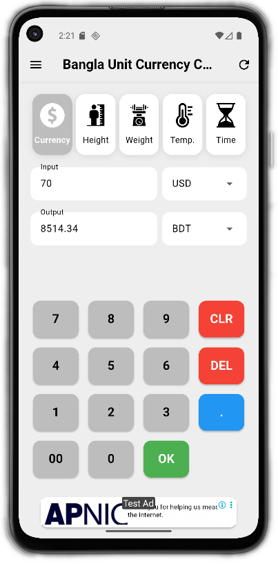
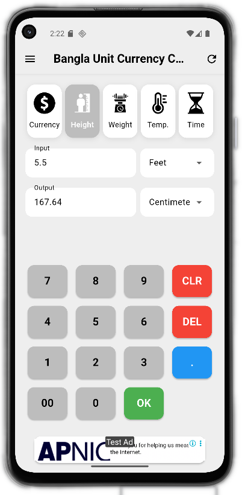
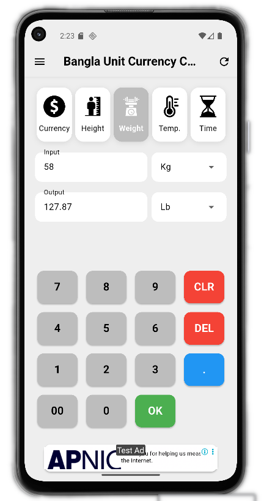
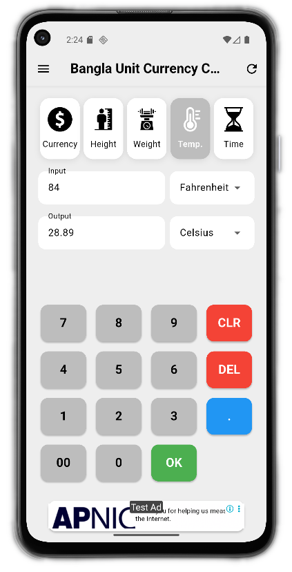
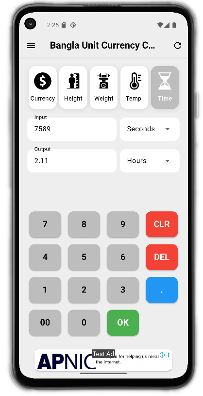
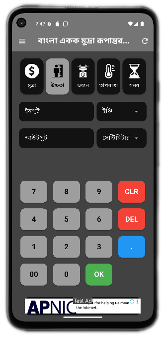
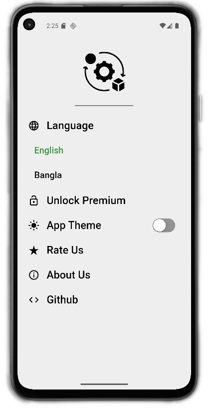
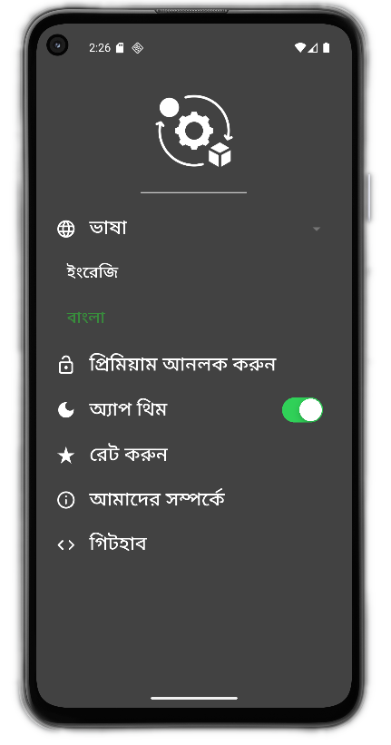

# 📱 Bangla Unit & Currency Converter

A versatile **Flutter-based mobile application** for seamless **unit and
currency conversions**, designed with special focus on **Bangladeshi
users** while being equally useful worldwide.
<br><br>
## ✨ Features

-   🌍 **Currency Conversion** -- Convert between **USD, BDT, and more**
    with real-time exchange rates *(requires internet connection)*.
-   📏 **Height Conversion** -- Switch between **feet, inches,
    centimeters, and meters** effortlessly.
-   ⚖️ **Weight Conversion** -- Convert **kilograms, pounds, and
    ounces** instantly.
-   🌡️ **Temperature Conversion** -- Accurate conversions between
    **Celsius and Fahrenheit**.
-   ⏱️ **Time Conversion** -- Convert between **hours, minutes, and
    seconds** with ease.
-   🈯 **Bilingual Support** -- Available in **English** and **Bangla**
    for a localized experience.
-   🎨 **Adaptive Themes** -- Enjoy both **dark** and **light modes**
    for comfortable usage.
-   🚫 **Non-Intrusive Ads** -- Minimal banner ads for a clean
    experience, with an option to **remove all ads** via a one-time
    purchase.
<br><br>

## 📸 Screenshots

|       Home (Light Mode)        |         Home (Dark Mode)       | 
|--------------------------------|--------------------------------|
|  |  |

|       Currency Conversion      |        Height Conversion       |       Weight Conversion        |
|--------------------------------|--------------------------------|--------------------------------|
|  |  |  |

|     Temperature Conversion     |         Time Conversion        |
|--------------------------------|--------------------------------|
|  |  |

|       Bilingual Support        |        Adaptive Themes         |       Non Intrusive Ads        |
|--------------------------------|--------------------------------|--------------------------------|
|  |  |  |


## ⚙️ Prerequisites  

Before installing and running the app, make sure you have:  

- ✅ [Flutter SDK](https://docs.flutter.dev/get-started/install) (latest stable version recommended)  
- ✅ [Dart](https://dart.dev/get-dart) (comes bundled with Flutter)  
- ✅ Android Studio or VS Code with Flutter & Dart plugins installed  
- ✅ A device/emulator (Android)  
- ✅ Internet connection *(required for real-time currency conversion)*  
- ✅ Git (for cloning the repository)  

### Optional (for contributors)  
- ✅ Xcode (for building & testing on iOS)  
- ✅ An IDE like [Android Studio](https://developer.android.com/studio) or [VS Code](https://code.visualstudio.com/)  
<br><br>
## 🚀 Installation

1.  Clone the repository:

    ``` bash
    git clone https://github.com/Nyctophilia58/bangla_unit_currency_converter.git
    ```

2.  Navigate to the project directory:

    ``` bash
    cd bangla_unit_currency_converter
    ```

3.  Install Flutter if not already installed -- [Flutter Installation
    Guide](https://docs.flutter.dev/get-started/install)

4.  Install dependencies:

    ``` bash
    flutter pub get
    ```

5.  Run the app on an emulator or device:

    -   **Android**:

        ``` bash
        flutter run
        ```
    -   **iOS**:

        ``` bash
        flutter run
        ```

        *(ensure Xcode is properly set up)*
<br><br>
## 📖 Usage

1.  Select the **conversion type** from the home screen.
2.  Enter your value using the on-screen keypad.
3.  Choose the **input** and **output units** from the dropdown menus.
4.  Tap **OK** to view the converted result.
<br><br>
## 🤝 Contributing

Contributions are always welcome!

### 🔄 Pull Request Process

1.  Fork the repository.

2.  Create a new branch for your feature or fix:

    ``` bash
    git checkout -b feature/your-feature-name
    ```

3.  Commit your changes with clear messages:

    ``` bash
    git commit -m "Add: short description of feature/fix"
    ```

4.  Push the branch:

    ``` bash
    git push origin feature/your-feature-name
    ```

5.  Open a **Pull Request** with:

    -   A clear description of the problem and solution.
    -   Screenshots or logs if relevant.
    -   Reference to any related issues.

Please make sure your code:
- Follows the project's coding style.
- Passes Flutter **analyzer** checks:
  
  ``` bash
  flutter analyze
  ```
  
- Builds successfully before submission.
<br><br>
## 📬 Contact

For questions, suggestions, or support:
- Open an issue on the [GitHub
repository](https://github.com/yourusername/bangla-unit-currency-converter)
- Or reach out at **nowtechdev@gmail.com**
